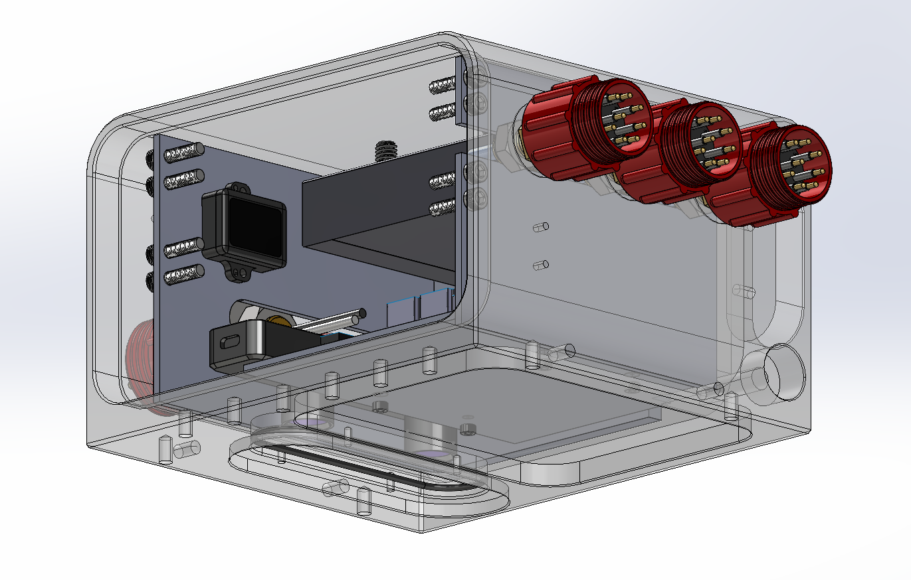
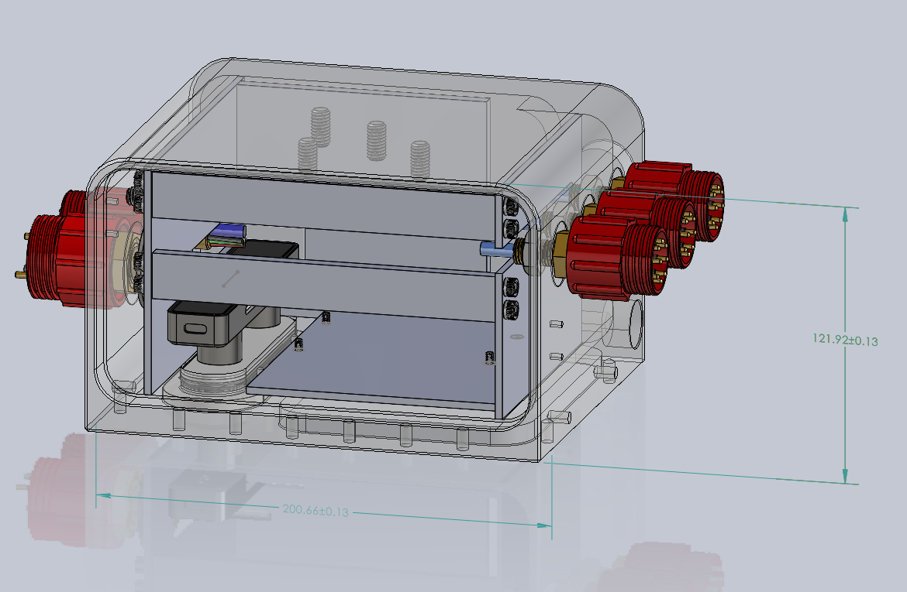
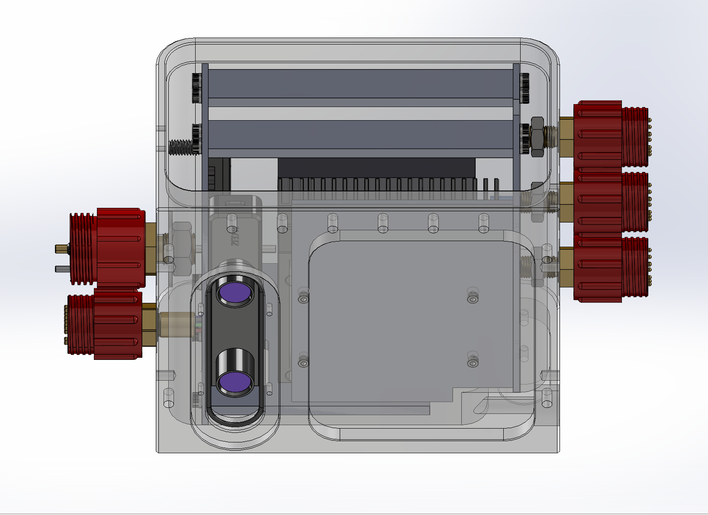

# Bring Your Own Robot with TURTLMap
TURTLMap is designed to be a flexible and modular framework for underwater localization and mapping. We understand the process to integrate a new robot with TURTLMap can be challenging, and is not as easy as running the provided logs. Therefore, we provide a guide on how to bring your own robot to TURTLMap. We will detail the process we build our system as an example.

## Sensor Calibration
Since TURTLMap is a sensor fusion-based localization and mapping system, the calibration of the sensors is crucial. We detail the calibration process of the sensors we use in our system.

### Extrinsics
It is critical to ensure accurate extrinsics between the sensors. The four main sensors we use in our system are the DVL, the pressure sensor, the IMU, and the ZED camera. Since we only use the relative depth, we do not need to calibrate the pressure sensor. We obtain the extrinsics between the DVL and the IMU according to the CAD model of the robot. To properly calibrate the extrinsics between the ZED camera and the IMU, we use [Kalibr](https://github.com/ethz-asl/kalibr). For the extrinsic calibration, we firstly mount the IMU and the ZED onto the sensor enclosure and conduct **in-air** calibration since it is much easier to excite the IMU in air. The calibrated extrinsics are stored in the [config](../param/br2config.yaml) file. Please feel free to edit the attributes in the file to match your robot.

### Camera Recalibration
As mentioned in our paper (Section III.C), underwater camera recalibration is necessary to ensure accurate mapping. There are various tools available to use for doing this. After several trials and attemps, we find using the stereo calibration tool provided by [Kalibr](https://github.com/ethz-asl/kalibr) gives the best results. We use a customized Aprilgrid following [this guide](https://github.com/ethz-asl/kalibr/wiki/calibration-targets). We provide an example of the [Aprilgrid](../param/example_april_grid.yaml) we use for the calibration.
#### Note
1. After generating the Apriltag PDF following [this guide](https://github.com/ethz-asl/kalibr/wiki/calibration-targets), please print the PDF in the correct size. It is **always recommended** to measure the size of the printed Apriltag to ensure the correct size.
2. Please double check the recommended depth rating of the camera you used, and determine the best desired depth you will use the camera underwater, and conduct the calibration within the desired operating depth.

#### Use Relibration Parameter in ZED SDK
We follow the [official guide](https://www.stereolabs.com/docs/opencv/calibration) to input the recalibration parameter in ZED SDK. We provide our [example config file](../param/example_zed_calib_param.yml) for your reference. To apply the config file, please edit `optional_opencv_calibration_file` to point to your own config file. You can follow [this commit](https://github.com/umfieldrobotics/zed-ros-wrapper/commit/658472b392c20070f6e818c8f9d21f80c8c4f9b8#diff-3272dab57af547664af0aa12c1e449fcdae2513933fcd0db1c4fb2a0e3edca37R249) to see how we apply the recalibration parameter in the ZED SDK.
We also deactivate the `self_calib` parameter in the ZED SDK to ensure the calibration parameters are not updated during the operation.

## Enclosure Design
We provide more views of the customized sensor enclosure. There is no need to make an exact copy of the enclosure. The key design factor of the enclosure is to ensure sensors are rigidly mounted, and the ZED camera is not occuluded by the enclosure.
<!-- [enclosure_view1](../media/enclosure_view_1.png) -->

## Communication
We hope to provide some important design factors to help people bring their own robot to TURTLMap. We understand that each robot is unique, and the process to integrate the robot with TURTLMap can be challenging. It is necessary to consider the bandwidth of the tether. One key benefit of the proposed solution is to leverage the onboard computing to reduce the bandwidth requirement of the tether. There is no need to send the raw data of the sensors to the surface computer. Since we use ROS as the communication middleware, we start the `roscore` on the Jetson Orin Nano.

